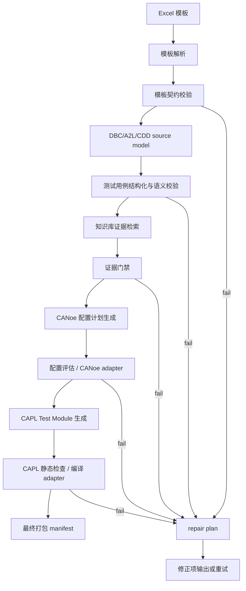

# CANoe_Gene 功能描述与工程设计报告

审阅基准：2026-06-13  
工程根目录：`F:/Canoe_Gene`

## 1. 工具定位

`CANoe_Gene` 是一个面向 Vector CANoe 自动化测试工程的生成工作流。它从测试工程师维护的 Excel 测试用例模板出发，经过模板解析、源文件语义检查、CANoe/CAPL 知识证据检索、配置计划生成、CAPL Test Module 生成、质量评估和修复分支，最终输出一组可追踪的 CANoe 自动化测试项目中间产物。

当前工程的重点不是“直接生成一个可发布的 CANoe `.cfg` 二进制工程”，而是建立一条可运行、可审查、可追踪、可扩展的自动化生成链路。真实 CANoe `.cfg` 渲染、CANoe/vTESTstudio 编译、XCP/诊断项目库绑定目前通过 adapter 边界显式保留。

## 2. 要解决的痛点

### 2.1 原始痛点

1. 测试用例通常以 Excel 维护，人工转 CAPL 容易漏项、误解字段、难以复用。
2. CANoe/CAPL API 多且版本敏感，生成脚本如果凭记忆写 API，容易产生幻觉或不可编译代码。
3. DBC/A2L/CDD 是测试语义的基础，但人工检查对象是否存在成本高。
4. CANoe 工程配置、CAPL 源码、报告计划、修复项经常散落，缺少可追踪运行记录。
5. 一旦生成失败，传统脚本通常只报错，不告诉用户该修 Excel、补源文件、补知识库，还是接入 CANoe adapter。

### 2.2 当前解决方式

1. 使用可重建 Excel 模板约束输入字段和下拉枚举。
2. 使用 Apache Burr 状态机表达生成流程，让成功路径、失败路径、重试路径显式化。
3. 使用知识库证据门禁，要求 CAPL API 能回溯到 CANoe/CAPL 知识页或团队规范。
4. 使用轻量 source model 先检查 DBC/A2L/CDD 是否存在，以及关键对象名是否可查询。
5. 每次运行进入 `generated_projects/<project>/runs/<run_id>`，并输出 manifest。
6. 对未实现的真实 CANoe 能力使用 adapter status 表达为 `skipped`、`manual_required` 或 `failed`，避免伪造成功。

## 3. 使用环境依赖

### 3.1 必需环境

| 类型 | 依赖 | 用途 |
| --- | --- | --- |
| 操作系统 | Windows 优先 | Vector CANoe 通常运行在 Windows，路径和 COM adapter 也按 Windows 设计 |
| Python | Python 3.x | 执行 Burr workflow、知识库校验、source model 解析 |
| Python 包 | `burr` | 构建和运行状态机 |
| Python 包 | `rank_bm25` | 知识库 BM25 检索索引加载和搜索 |
| 文件资产 | `knowledge_base/` | CANoe/CAPL 结构化知识、agent 索引、workflow 契约 |
| 文件资产 | `templates/canoe_test_case_template/` | Excel 模板、字段映射、模板生成脚本 |

### 3.2 模板维护环境

| 类型 | 依赖 | 用途 |
| --- | --- | --- |
| Node.js | bundled node 或本机 node | 运行 `build_template.mjs` |
| Node 包 | `@oai/artifact-tool` | 构建、渲染、导出 Excel 模板 |

### 3.3 可选环境

| 类型 | 依赖 | 用途 |
| --- | --- | --- |
| Vector CANoe | CANoe 12/15/17 等 | 人工或自动加载配置、编译 CAPL |
| Python COM | `pywin32`/`win32com` | 后续实现 CANoe COM 自动化 adapter |
| 向量检索依赖 | embedding/rerank 模型 | 可选增强语义检索，默认关闭 |

## 4. 文件输入

### 4.1 主输入

| 输入 | 示例 | 说明 |
| --- | --- | --- |
| Excel 测试用例模板 | `templates/canoe_test_case_template/CANoe自动化测试用例模板.xlsx` | 工程配置、通道配置、生成策略、测试步骤 |
| 字段映射文件 | `templates/canoe_test_case_template/template_field_mapping.json` | Excel 列名、枚举值、比较符映射 |

### 4.2 可选源文件输入

| 输入 | 用途 | 当前解析深度 |
| --- | --- | --- |
| DBC | 校验 CAN 报文和信号对象 | 解析 `BO_`、`SG_` 名称级索引 |
| A2L | 校验 XCP 标定量和观测量 | 解析 `CHARACTERISTIC`、`MEASUREMENT` 名称级索引 |
| CDD | 校验诊断服务名称 | 提取 `SHORT-NAME` 和若干 service/name/qualifier 文本 |
| 需求文件 | 需求追踪 | 当前主要作为路径输入，深层语义尚未展开 |

### 4.3 命令行控制输入

| 参数 | 作用 |
| --- | --- |
| `--excel` | 指定 Excel 输入 |
| `--out` | 指定输出根目录 |
| `--run-id` | 指定本次运行 ID |
| `--strict-source-validation` | 缺失或未解析的 DBC/A2L/CDD 语义升级为 error |
| `--canoe-validation-mode disabled|manual|automated` | 控制外部 CANoe 验证模式 |
| `--tracking` | 启用 Burr local tracking |

## 5. 文件输出

每次运行输出到：

```text
generated_projects/<project>/runs/<run_id>/
```

主要输出包括：

| 输出 | 说明 |
| --- | --- |
| `template_contract_report.json` | 模板字段契约校验结果 |
| `source_models.json` | DBC/A2L/CDD 轻量 source model 和解析问题 |
| `structured_test_cases.json` | 从 Excel 转换后的结构化测试用例 |
| `test_case_correction_items.json` | 测试用例和源文件修正项 |
| `evidence_bundle.json` | CAPL API 和团队规范证据包 |
| `evidence_gate_report.json` | 证据门禁结果 |
| `<Project>.cfg.todo.json` | CANoe 配置生成计划，不是真实二进制 `.cfg` |
| `canoe_project_layout_manifest.json` | CANoe 项目目录和预期产物布局 |
| `<Project>_TestModule.can` | 生成的 CAPL Test Module 源文件 |
| `capl_script_plan.json` | CAPL 生成计划、证据页、adapter notes |
| `test_report_plan.json` | 测试报告计划 |
| `final_package_manifest.json` | 成功运行最终 manifest |
| `blocked_manifest.json` | 被修复项阻塞时的 manifest |
| `repair_plan.json` | 修复计划和下一步动作 |

`generated_projects/<project>/latest_run_manifest.json` 指向最近一次运行。

## 6. 工程层级结构

### 6.1 目录视图

```text
F:/Canoe_Gene/
  README.md
  CANoeCANalyzer.chm
  docs/
    WORKSPACE_STRUCTURE_AND_WORKFLOW_EVALUATION.md
    CANOE_GENE_FUNCTIONAL_DESIGN_REPORT.md
  templates/
    canoe_test_case_template/
      CANoe自动化测试用例模板.xlsx
      build_template.mjs
      template_field_mapping.json
      *_preview.png
  workflows/
    canoe_auto_generation_burr/
      canoe_workflow.py
      vector_canoe_adapter.py
      validate_workflow_profile.py
      workflow_profile.json
      template_field_mapping.json
  knowledge_base/
    knowledge/
    agent_kb/
    retriever/
    workflow_kb/
    extras/team/
    scripts/
    tests_integration/
  generated_projects/
    EQ07_workflow_test/
      latest_run_manifest.json
      runs/
        <run_id>/
```

### 6.2 流程视图



## 7. 分层与模块详细设计

## 7.1 输入模板层

### 7.1.1 Excel 模板生成模块

位置：`templates/canoe_test_case_template/build_template.mjs`

目的：生成测试工程师可填写的 Excel 模板，包括工程参数、通道配置、生成策略、测试用例步骤、下拉框、完整性检查公式和预览图。

设计：

1. 使用 `@oai/artifact-tool` 创建 workbook。
2. 从 `template_field_mapping.json` 读取枚举和字段名。
3. 在 Excel 中添加数据验证下拉框，限制操作类型、条件类型、结果类型、优先级等。
4. 输出 `.xlsx` 和预览 `.png`，便于人工审查模板是否生成正确。

SubAgent 评估：

| 评估项 | 内容 |
| --- | --- |
| 设计目的 | 让测试人员用熟悉的 Excel 表达测试意图，同时让程序得到结构化输入 |
| 当前设计优点 | 模板可重建，下拉枚举来自统一映射，降低手工维护漂移 |
| 可替代方案 | 直接维护手写 Excel、使用 Web 表单、使用 YAML/JSON |
| 未选原因 | 手写 Excel 容易漂移；Web 表单需要额外系统；YAML/JSON 对测试人员不友好 |
| 更优方案 | 中长期可增加 Web 表单，但仍输出同一 canonical IR，Excel 保留为离线输入方式 |

### 7.1.2 字段映射契约模块

位置：`templates/canoe_test_case_template/template_field_mapping.json`

目的：作为 Excel 模板和 workflow 的字段/枚举单一事实源。

设计：

1. 定义工程配置表头、通道配置表头、策略表头。
2. 定义测试用例列名。
3. 定义操作类型、条件类型、结果类型、比较符映射。
4. workflow 目录中的 `template_field_mapping.json` 只保存 source-of-truth 指针。

SubAgent 评估：

| 评估项 | 内容 |
| --- | --- |
| 设计目的 | 防止 Excel 下拉值和 Python 校验枚举各维护一套 |
| 当前设计优点 | 修改字段或枚举时只需要关注一个 canonical 文件 |
| 可替代方案 | 在 Python 中硬编码枚举，或让 Excel 和 Python 各自维护 |
| 未选原因 | 硬编码会导致模板和 workflow 不一致，长期维护风险高 |
| 更优方案 | 在字段映射中增加稳定英文字段 ID，实现中文展示名和内部字段名解耦 |

## 7.2 Workflow 编排层

### 7.2.1 Burr 状态机模块

位置：`workflows/canoe_auto_generation_burr/canoe_workflow.py`

目的：把生成流程表达为可分支、可重试、可追踪的状态机。

设计：

1. 每个处理步骤使用 `@action` 声明 reads/writes。
2. `ACTION_REGISTRY` 集中注册 action。
3. `TRANSITION_SPECS` 集中定义状态转移和条件。
4. `build_application()` 将 action、transition、初始状态组合为 Burr 应用。
5. `run_workflow()` 负责 run id、输出目录、输入 hash 和 halt_after。

SubAgent 评估：

| 评估项 | 内容 |
| --- | --- |
| 设计目的 | 将复杂生成流程从线性脚本升级为显式状态机 |
| 当前设计优点 | 成功路径、失败路径、修复路径清晰；profile 可校验 |
| 可替代方案 | 单个 Python main 顺序执行；Airflow/Prefect 等工作流引擎 |
| 未选原因 | 单脚本难以表达修复分支；大型调度系统对本地生成工具过重 |
| 更优方案 | 保留 Burr，但将 2000 行 monolith 拆成 parser、gate、renderer、adapter 模块 |

### 7.2.2 Workflow Profile 校验模块

位置：`workflows/canoe_auto_generation_burr/workflow_profile.json`  
位置：`workflows/canoe_auto_generation_burr/validate_workflow_profile.py`

目的：让“文档化的 workflow 契约”和实际 Python graph 保持一致。

设计：

1. `workflow_profile.json` 记录 action、reads/writes、transition、extension points。
2. 校验脚本加载 Python 中的 `ACTION_REGISTRY` 和 `TRANSITION_SPECS`。
3. 比较 profile 和代码是否存在缺失 action、缺失 transition、悬挂节点。

SubAgent 评估：

| 评估项 | 内容 |
| --- | --- |
| 设计目的 | 防止文档和代码分离，降低后来维护者误读风险 |
| 当前设计优点 | 已能自动校验 action 和 transition 一致性 |
| 可替代方案 | 只靠 README 文档；从 JSON profile 直接生成 graph |
| 未选原因 | 只靠 README 不可靠；profile 驱动 graph 需要更多工程化 |
| 更优方案 | 将 profile 升级为 graph 的唯一来源，由 profile 生成 Burr builder |

### 7.2.3 模板解析模块

位置：`parse_template()`、`read_xlsx_tables()`

目的：读取 Excel 中的工程配置、通道配置、生成策略和测试步骤。

设计：

1. 使用 `zipfile` 和 OpenXML 读取 `.xlsx`。
2. 根据 sheet 名和表头定位数据区域。
3. 将配置表转换为 `project_config`。
4. 将测试步骤转换为 row dict 列表。

SubAgent 评估：

| 评估项 | 内容 |
| --- | --- |
| 设计目的 | 不依赖 Excel GUI，在 CI 或无 Office 环境下也能解析 |
| 当前设计优点 | 轻量、离线、可控 |
| 可替代方案 | 使用 openpyxl；通过 Excel COM 读取；直接要求 JSON 输入 |
| 未选原因 | COM 依赖桌面环境；JSON 对用户不友好；手写 OpenXML 已满足当前需求 |
| 更优方案 | 使用 `openpyxl` 或封装独立 parser，并输出 canonical IR，减少中文列名在业务逻辑中扩散 |

### 7.2.4 模板契约门禁模块

位置：`validate_template_contract()`

目的：确保 Excel 模板字段和 workflow 期望字段一致。

设计：

1. 检查 canonical mapping 文件是否存在。
2. 检查 workflow 指针是否指向 canonical mapping。
3. 检查测试用例列是否包含 mapping 中定义的列。
4. 检查操作/条件/结果枚举非空。

SubAgent 评估：

| 评估项 | 内容 |
| --- | --- |
| 设计目的 | 在解析后、生成前尽早发现模板漂移 |
| 当前设计优点 | 可快速定位模板契约问题 |
| 可替代方案 | 运行到生成阶段再报错；只依赖 Excel 数据验证 |
| 未选原因 | 后期报错定位困难；Excel 数据验证无法保证文件被外部工具修改后仍正确 |
| 更优方案 | 引入 JSON Schema 或 Pydantic model，对解析后的 IR 做强类型校验 |

## 7.3 Source Model 层

### 7.3.1 源文件路径解析模块

位置：`_source_files_from_state()`、`_resolve_declared_path()`

目的：从 CLI、工程配置、通道配置中收集 DBC/A2L/CDD/需求文件路径，并解析为实际路径。

设计：

1. CLI 显式路径优先。
2. 工程基础配置路径作为默认值。
3. 通道配置路径补充每个通信通道挂载文件。
4. 相对路径尝试从模板目录、工程根目录、当前工作目录解析。

SubAgent 评估：

| 评估项 | 内容 |
| --- | --- |
| 设计目的 | 允许用户在 Excel 或 CLI 中声明源文件，降低使用门槛 |
| 当前设计优点 | 路径解析容错较好，能报告候选路径和 resolved 路径 |
| 可替代方案 | 强制所有路径为绝对路径；强制所有源文件放固定目录 |
| 未选原因 | 固定路径会增加用户迁移成本；绝对路径不利于项目打包 |
| 更优方案 | 增加项目工作区变量，例如 `${PROJECT_ROOT}`、`${TEMPLATE_DIR}` |

### 7.3.2 DBC 轻量解析模块

位置：`_parse_dbc_file()`

目的：从 DBC 中提取报文和信号名称，供测试用例对象存在性检查。

设计：

1. 正则扫描 `BO_` 获取 message id、name、dlc、transmitter。
2. 正则扫描 `SG_` 获取 signal name。
3. 构建 `messages` 和 `signals` 索引。

SubAgent 评估：

| 评估项 | 内容 |
| --- | --- |
| 设计目的 | 快速检查 Excel 中的 CAN 报文/信号是否存在 |
| 当前设计优点 | 无外部依赖、速度快、足够做名称级校验 |
| 可替代方案 | 使用 `cantools` 完整解析 DBC |
| 未选原因 | 当前阶段先保证生成链路跑通，减少依赖复杂度 |
| 更优方案 | 引入 `cantools` 或团队 DBC parser，解析 bit layout、factor、offset、value table |

### 7.3.3 A2L 轻量解析模块

位置：`_parse_a2l_file()`

目的：从 A2L 中提取标定量和观测量名称，校验 XCP 相关步骤。

设计：

1. 正则扫描 `/begin CHARACTERISTIC`。
2. 正则扫描 `/begin MEASUREMENT`。
3. 输出 characteristic 和 measurement 名称清单。

SubAgent 评估：

| 评估项 | 内容 |
| --- | --- |
| 设计目的 | 避免 Excel 中写了不存在的 XCP 标定量或观测量 |
| 当前设计优点 | 名称级检查轻量有效 |
| 可替代方案 | 使用 ASAM A2L parser；通过 CANoe/XCP 工程查询 |
| 未选原因 | 完整 A2L 语义复杂，且项目 XCP 连接信息通常需要 adapter |
| 更优方案 | 接入团队认可的 A2L parser，进一步解析类型、转换公式、地址和访问权限 |

### 7.3.4 CDD 轻量解析模块

位置：`_parse_cdd_file()`

目的：从 CDD 或诊断 XML 文本中提取诊断服务候选名称。

设计：

1. 提取 `<SHORT-NAME>`。
2. 尝试识别 `SERVICE`、`service`、`qualifier`、`name` 等文本。
3. 生成 service 名称清单。

SubAgent 评估：

| 评估项 | 内容 |
| --- | --- |
| 设计目的 | 在没有 Vector 诊断库 adapter 时，先做基础服务名检查 |
| 当前设计优点 | 可离线运行，能捕捉明显缺失 |
| 可替代方案 | 使用 Vector 诊断数据库接口或团队 CDD parser |
| 未选原因 | CDD 格式和诊断绑定强依赖项目环境 |
| 更优方案 | 接入 CANoe diagnostics adapter，解析请求/响应参数、DID、NRC、target qualifier |

### 7.3.5 Strict Source Validation 模块

位置：`_strict_source_validation()`、`parse_source_files()`、`validate_test_cases()`

目的：允许同一 workflow 在宽松探索模式和严格交付模式之间切换。

设计：

1. 普通模式下，源文件缺失或对象未解析为 warning。
2. `--strict-source-validation` 下升级为 error。
3. error 进入 `plan_repair` 和 `emit_test_case_corrections`。

SubAgent 评估：

| 评估项 | 内容 |
| --- | --- |
| 设计目的 | 支持早期快速生成，也支持交付前严格拦截 |
| 当前设计优点 | 模式边界清楚，不会把示例源文件缺失伪装成成功 |
| 可替代方案 | 永远严格；永远宽松 |
| 未选原因 | 永远严格不利于早期试跑；永远宽松不利于交付质量 |
| 更优方案 | 增加 profile 级策略，比如 `exploration`、`ci`、`release` 三档门禁 |

## 7.4 测试用例结构化与校验层

### 7.4.1 结构化测试用例模块

位置：`_group_steps()`、`_write_structured_test_case()`

目的：把 Excel 的一行一步转换为按 case 聚合的结构化测试用例。

设计：

1. 按 `case_id` 聚合步骤。
2. 保留 requirement、feature、priority、automation、preconditions。
3. 每步拆为 `operation`、`condition`、`expected_result`、`cleanup`、`notes`。
4. 输出 `structured_test_cases.json`。

SubAgent 评估：

| 评估项 | 内容 |
| --- | --- |
| 设计目的 | 让后续生成器不直接处理 Excel 行表，而处理结构化测试语义 |
| 当前设计优点 | 已经形成 IR 雏形，便于 CAPL 生成和报告计划复用 |
| 可替代方案 | 直接在 CAPL renderer 中遍历 Excel row |
| 未选原因 | 直接遍历 Excel row 会让生成器和模板强耦合 |
| 更优方案 | 建立真正 canonical IR，使用稳定英文 enum 和字段 ID，彻底隔离中文模板字段 |

### 7.4.2 测试用例质量校验模块

位置：`validate_test_cases()`

目的：检查工程配置、通道、测试步骤字段、枚举、源对象语义是否满足生成条件。

设计：

1. 检查工程名、目标 CANoe 版本、启用通道。
2. 检查通道名称、波特率、CANFD 数据波特率等。
3. 检查操作/条件/结果类型是否属于映射枚举。
4. 检查 CAN/XCP/诊断步骤是否填写必要对象和源文件路径。
5. 使用 source model 检查对象是否存在。
6. 输出修正项。

SubAgent 评估：

| 评估项 | 内容 |
| --- | --- |
| 设计目的 | 在生成 CAPL 前拦截低质量输入 |
| 当前设计优点 | 能把错误定位到 case、step、field |
| 可替代方案 | 生成后靠 CAPL 编译发现；完全依赖人工 review |
| 未选原因 | 编译错误离 Excel 原始问题太远；人工 review 不可规模化 |
| 更优方案 | 引入 schema + rule engine，使新增操作类型时少改大函数 |

## 7.5 知识库与证据链层

### 7.5.1 原始知识库模块

位置：`knowledge_base/knowledge/`

目的：保存 Vector CANoe/CAPL 文档结构化结果，按版本、主题、页面拆分。

设计：

1. 按 `v12`、`v15` 等版本组织。
2. 按 `capl`、`panel`、`dbc`、`xcp`、`diagnostics` 主题组织。
3. 每个页面同时有 `.json` 结构化文件和 `.md` 渲染文件。

SubAgent 评估：

| 评估项 | 内容 |
| --- | --- |
| 设计目的 | 让生成器有可回溯的 API 事实来源 |
| 当前设计优点 | 页面粒度细，适合 exact lookup 和 grounding |
| 可替代方案 | 运行时直接查 CHM；把知识写进 prompt |
| 未选原因 | CHM 运行时查询不稳定；prompt 内置知识不可维护、不可回溯 |
| 更优方案 | 定期从新版 CHM 重建，并增加版本差异自动报告 |

### 7.5.2 Agent KB 精确查找模块

位置：`knowledge_base/agent_kb/kb_lookup.py`

目的：为 workflow 和 agent 提供快速符号解析、页面加载、场景匹配。

设计：

1. `resolve_symbol()` 将 CAPL symbol 映射到 page id。
2. `load_page()` 加载指定版本页面。
3. `match_scenario()` 将自然语言意图匹配到常见场景。
4. `search()` 作为自由检索 fallback。

SubAgent 评估：

| 评估项 | 内容 |
| --- | --- |
| 设计目的 | 生成 CAPL 前先查证 API 是否存在 |
| 当前设计优点 | exact lookup 快，证据可追踪到页面 |
| 可替代方案 | 每次用 BM25 搜；让 LLM 凭记忆生成 |
| 未选原因 | 搜索有噪声；凭记忆生成风险高 |
| 更优方案 | 增加 API 签名级校验，验证生成 CAPL 调用形式是否匹配文档 overload |

### 7.5.3 Retriever 检索模块

位置：`knowledge_base/retriever/`

目的：提供自由文本搜索、BM25 候选召回、可选向量和 rerank。

设计：

1. 默认加载 `artifacts/bm25.pkl`。
2. 根据 query classifier 判断 exact、semantic、hybrid。
3. 默认不用 vector，除非显式环境变量启用。
4. 返回 hit 后由 `grounding.py` 重新加载源 JSON，输出 canonical facts。

SubAgent 评估：

| 评估项 | 内容 |
| --- | --- |
| 设计目的 | 当 exact symbol 不足时，提供候选检索能力 |
| 当前设计优点 | 默认无模型依赖，离线可复现 |
| 可替代方案 | 默认使用 embedding 向量库；只用全文 grep |
| 未选原因 | 向量模型依赖重；grep 对中英文和同义表达弱 |
| 更优方案 | 在 CI 或开发环境中可选启用 rerank，并保存评测集衡量召回质量 |

### 7.5.4 证据检索与门禁模块

位置：`retrieve_evidence()`、`validate_evidence_gate()`

目的：为每个测试用例需要的 CAPL API 收集证据，并在缺失时阻塞生成。

设计：

1. 根据操作/条件/结果类型映射到所需 CAPL symbols。
2. 对每个 symbol 调用 agent_kb exact lookup。
3. 加载团队规范 `extras/team`。
4. 输出 `evidence_bundle.json`。
5. 若证据缺口存在且门禁启用，输出 fail。

SubAgent 评估：

| 评估项 | 内容 |
| --- | --- |
| 设计目的 | 防止生成器使用未经验证的 CAPL API |
| 当前设计优点 | 证据链独立成包，能审查每个 API 的来源 |
| 可替代方案 | 直接由 CAPL renderer 生成并等待编译报错 |
| 未选原因 | 编译环境不一定存在，且 API 幻觉应尽早拦截 |
| 更优方案 | 把 evidence gate 扩展到函数参数、CANoe 版本可用性、团队禁用 API |

## 7.6 CANoe 配置计划层

### 7.6.1 配置计划生成模块

位置：`generate_canoe_config()`

目的：根据结构化用例和通道配置生成 CANoe 项目配置计划。

设计：

1. 输出 `<Project>.cfg.todo.json`。
2. 记录 target CANoe version、project name、channels、mounted files。
3. 记录 test module 需要挂载的 `.can` 文件。
4. 明确 `generation_mode=adapter_plan`，说明这不是二进制 `.cfg`。

SubAgent 评估：

| 评估项 | 内容 |
| --- | --- |
| 设计目的 | 在真实 CANoe CFG renderer 未实现前，先形成可审查的配置计划 |
| 当前设计优点 | 不伪装 `.cfg` 已完成，边界清晰 |
| 可替代方案 | 直接生成空 `.cfg`；通过 CANoe COM 立即创建配置 |
| 未选原因 | 空 `.cfg` 没价值；COM 方案需要真实 CANoe 环境和项目模板 |
| 更优方案 | 使用团队 base `.cfg` 模板，通过 CANoe COM 或 Vector API 挂载 DBC、A2L、CDD、CAPL |

### 7.6.2 配置评估与外部 adapter 模块

位置：`evaluate_canoe_config()`、`vector_canoe_adapter.py`

目的：对配置计划做基础结构检查，并接入未来真实 CANoe 验证。

设计：

1. 检查是否有启用通道。
2. 检查通道是否有 CANoe channel name。
3. 调用 `validate_config()`。
4. adapter 按 `disabled`、`manual`、`automated` 返回状态。

SubAgent 评估：

| 评估项 | 内容 |
| --- | --- |
| 设计目的 | 把真实 CANoe 验证边界显式化 |
| 当前设计优点 | 不会在未执行 CANoe 时宣称验证成功 |
| 可替代方案 | 在 workflow 内直接写 COM 操作；完全不做外部验证接口 |
| 未选原因 | 直接 COM 会污染核心流程；无接口会导致后期接入困难 |
| 更优方案 | 实现 `automated` 模式：打开 base cfg、挂载文件、添加 test module、保存工程、返回 CANoe load report |

## 7.7 CAPL 生成层

### 7.7.1 CAPL Renderer 模块

位置：`generate_capl_script()`、`_render_capl_operation()`、`_render_capl_check()`

目的：把结构化测试用例渲染为 CAPL Test Module 源文件。

设计：

1. 生成文件头，声明目标 CANoe 版本。
2. 根据 CAN 报文发送步骤声明 `message <Name> msg_<Name>`。
3. 为每个 case 生成一个 `testcase`。
4. CAN 报文发送生成 `output(msg)`。
5. CAN 信号赋值生成 `setSignal(...)`。
6. 等待和检查生成 `TestWaitForTimeout`、`TestWaitForMessage`、`TestWaitForSignalMatch` 等。
7. XCP、诊断、复杂检查使用 `CanoeGene_*` adapter stub 显式标记。

SubAgent 评估：

| 评估项 | 内容 |
| --- | --- |
| 设计目的 | 先生成可读、可审查、可静态检查的 CAPL 中间产物 |
| 当前设计优点 | 保守生成，不把项目专属 XCP/诊断能力伪装成已完成 |
| 可替代方案 | 生成伪代码；直接让 LLM 生成完整 CAPL；完全不生成 CAPL |
| 未选原因 | 伪代码交付价值低；LLM 直接生成不可控；不生成 CAPL 无法验证链路 |
| 更优方案 | 拆分 renderer，支持周期报文 timer、诊断 request object、XCP 库绑定、参数化模板 |

### 7.7.2 CAPL Adapter Stub 模块

位置：生成的 `CanoeGene_*` 函数

目的：对暂未绑定的项目能力提供显式占位和报告注释。

设计：

1. `CanoeGene_SetXcpCalibration()` 表示 XCP 标定写入需要项目 adapter。
2. `CanoeGene_SendDiagnosticRequest()` 表示诊断请求需要项目 adapter。
3. `CanoeGene_CheckMeasurement()` 表示测量量检查需要 XCP/measurement adapter。
4. adapter notes 写入 `capl_script_plan.json`。

SubAgent 评估：

| 评估项 | 内容 |
| --- | --- |
| 设计目的 | 不阻塞整体生成链路，同时把未完成能力暴露出来 |
| 当前设计优点 | 审查者能直接看到哪些步骤仍需项目绑定 |
| 可替代方案 | 对未支持能力直接 fail；或生成看似真实的调用 |
| 未选原因 | 直接 fail 不利于早期评估；伪真实调用风险更大 |
| 更优方案 | 对 release 模式禁止 adapter stub，通过门禁要求真实绑定 |

### 7.7.3 CAPL 静态评估模块

位置：`evaluate_capl_script()`、`_capl_static_lint()`

目的：在没有 CANoe 编译器的情况下做基础结构检查，并预留真实编译 adapter。

设计：

1. 检查 CAPL 文件是否存在。
2. 检查 header、variables block、括号平衡、testcase 数量。
3. 检查 `output()` 是否有 message 声明。
4. 调用 `compile_capl()` adapter。

SubAgent 评估：

| 评估项 | 内容 |
| --- | --- |
| 设计目的 | 尽早发现明显生成错误，并记录外部编译状态 |
| 当前设计优点 | 不需要 CANoe 也可做基础检查 |
| 可替代方案 | 只依赖 CANoe 编译；完全不检查 |
| 未选原因 | CANoe 可能不可用；不检查会导致明显错误进入产物 |
| 更优方案 | 增加 CAPL lexer 级检查、API 参数检查，并接入真实 CANoe/vTESTstudio compile |

## 7.8 修复与交付层

### 7.8.1 Repair Planner 模块

位置：`plan_repair()`

目的：汇总失败原因，决定下一步是重试生成还是输出人工修正项。

设计：

1. 按失败来源识别 origin：模板契约、测试用例、证据门禁、配置评估、CAPL 评估。
2. 聚合 repair items。
3. 根据 retry count 和 failure 类型决定 `repair_next_action`。
4. 输出 `repair_plan.json`。

SubAgent 评估：

| 评估项 | 内容 |
| --- | --- |
| 设计目的 | 让失败可解释，避免用户只看到 traceback |
| 当前设计优点 | 能说明该补 Excel、补源文件、补知识库还是补 adapter |
| 可替代方案 | 抛异常退出；只输出日志 |
| 未选原因 | 异常和日志不适合非开发用户修正输入 |
| 更优方案 | 生成面向 Excel 的修正 patch 或可导入的 correction workbook |

### 7.8.2 输出打包模块

位置：`package_outputs()`、`emit_test_case_corrections()`

目的：将成功或阻塞的运行结果整理为 manifest。

设计：

1. 成功时输出 `final_package_manifest.json`。
2. 阻塞时输出 `blocked_manifest.json`。
3. 基础输出目录写 `latest_run_manifest.json`。
4. 每次运行隔离在 `runs/<run_id>`。

SubAgent 评估：

| 评估项 | 内容 |
| --- | --- |
| 设计目的 | 让每次生成结果可追踪、可复现、可比较 |
| 当前设计优点 | 不覆盖历史产物，latest 指针清晰 |
| 可替代方案 | 每次直接覆盖输出目录；只打印结果 |
| 未选原因 | 覆盖会丢失历史，打印结果不便后续工具读取 |
| 更优方案 | 增加 run 清理策略、产物压缩包、差异报告和发布状态标记 |

## 7.9 Workflow KB 契约层

### 7.9.1 Workflow Manifest 模块

位置：`knowledge_base/workflow_kb/workflow_manifest.json`

目的：描述可扩展 workflow contract layer，包括 schemas、actions、packs、retrieval profiles、generation patterns、validation rules。

设计：

1. 将 action contract、生成 pattern、validation rule 分离为 JSON。
2. 用 packs 表达 domain 扩展，例如 can_signal、diagnostics、panel、dbc、team_eq07。
3. 用 `validate_workflow_kb.py` 检查引用是否存在且 JSON 可读。

SubAgent 评估：

| 评估项 | 内容 |
| --- | --- |
| 设计目的 | 为未来多领域、多 profile 的生成工作流提供契约层 |
| 当前设计优点 | 扩展点清楚，引用可校验 |
| 可替代方案 | 所有规则写死在 Python 里 |
| 未选原因 | 写死后新增领域会频繁改核心 workflow |
| 更优方案 | 让 workflow_kb 的 action contract 真正驱动 runtime，而不只是文档/校验层 |

## 8. 当前设计思路总结

当前工程的核心设计思想可以概括为：

1. 输入端尊重测试团队习惯，用 Excel 作为主入口。
2. 工程内部通过结构化状态机管理复杂流程，而不是线性脚本。
3. 所有生成动作都尽量有证据来源，尤其是 CAPL API。
4. 不确定或项目专属能力通过 adapter 和 stub 显式暴露，不假装完成。
5. 所有运行结果进入 run 目录，形成可追踪产物。
6. 宽松模式支持快速试跑，严格模式支持交付前拦截。

这是一种“先建立可审计生成链路，再逐步替换深层 adapter”的工程路线。

## 9. 当前不足

| 不足 | 影响 |
| --- | --- |
| `canoe_workflow.py` 过大 | 模板解析、校验、生成、评估混在一个文件，学习和维护成本高 |
| 内部 IR 不够 canonical | 中文 Excel 字段仍大量进入业务逻辑，模板展示名变化会影响代码 |
| DBC/A2L/CDD parser 仍是轻量级 | 只能名称级检查，不能支撑完整交付级语义 |
| 未生成真实 CANoe `.cfg` | 当前只有 `.cfg.todo.json` 配置计划 |
| 未执行真实 CANoe/vTESTstudio 编译 | CAPL 只能通过静态 lint，不能宣称实机可编译 |
| XCP/诊断仍是 adapter stub | 不能直接执行真实标定写入或诊断请求 |
| 静态 lint 较浅 | 未做完整 CAPL 语法、API 参数、版本兼容校验 |
| 产物清理策略缺失 | `runs/` 长期增长后可能难以管理 |
| Windows 终端编码容易误导 | PowerShell 默认编码可能把 UTF-8 中文显示为乱码 |

## 10. 后续改进方案

### 10.1 P0：交付可信度提升

1. 实现真实 CANoe adapter：打开 base `.cfg`，挂载 DBC/A2L/CDD，添加 CAPL test module，保存并返回加载结果。
2. 接入 CANoe/vTESTstudio 编译，生成 compile report。
3. 引入完整 DBC parser，例如 `cantools` 或团队 parser。
4. 为 A2L/CDD 接入团队认可 parser 或 Vector adapter。
5. release 模式下禁止未绑定的 `CanoeGene_*` stub 作为最终产物通过。

### 10.2 P1：架构可维护性提升

1. 拆分 `canoe_workflow.py`：
   - `template_parser.py`
   - `source_model.py`
   - `test_case_ir.py`
   - `evidence_gate.py`
   - `canoe_config.py`
   - `capl_renderer.py`
   - `repair.py`
2. 建立 canonical IR：
   - 中文 Excel 字段只存在于 input adapter。
   - 内部使用英文稳定字段和 enum。
   - 用 schema/Pydantic 校验 IR。
3. 将规则从大函数迁移到可配置 rule table 或 workflow_kb validation rules。

### 10.3 P2：用户体验和工程化

1. 输出 Excel 修正包，让用户能直接看到哪一行哪一列要改。
2. 增加运行摘要 HTML 报告。
3. 增加 run retention 配置，例如保留最近 20 次或最近 30 天。
4. 增加 sample DBC/A2L/CDD，保证 strict 模式有成功样例。
5. 增加 CI 脚本：profile 校验、workflow_kb 校验、Python compile、样例 workflow run。

## 11. 建议的目标架构


目标状态下，Excel 只是输入方式之一；真正稳定的是 canonical IR、Project Spec 和验证报告。这样后续可以新增 Web 表单、API 输入、不同车型 profile，而不需要重写 CAPL renderer 和 CANoe adapter。

## 12. 一句话结论

当前 `CANoe_Gene` 已经具备“可运行的自动化生成工作流骨架”和“证据链驱动的质量门禁”，适合作为 CANoe 自动化测试生成平台的中间层。它的下一阶段重点不是继续堆脚本，而是完成三件事：建立 canonical IR、接入真实 Vector/CANoe adapter、用完整 source parser 替换轻量名称级 parser。
