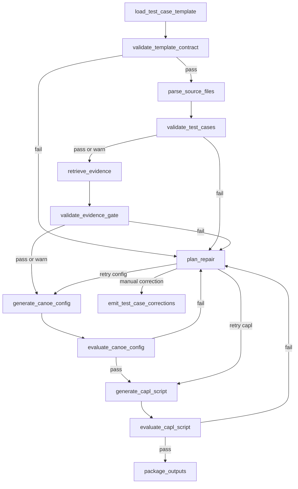

# CANoe_Gene 工程结构与 Burr 工作流评估报告

> 2026-06-18 更新：本文是 2026-06-13 的阶段性评估报告。当前准确结构、
> workflow graph、模块边界、清理策略和验证命令，以
> [`ARCHITECTURE_CURRENT.md`](./ARCHITECTURE_CURRENT.md) 为准。
>
> 当前关键变化：工程根目录为 `E:/Canoe_Gene/CANoe_Cfg_AutoGene`；Burr
> profile 已验证为 14 个 action、19 条 transition；新增 CI 检查入口
> `ci/run_checks.py`；运行产物 `generated_projects/` 已清理并加入
> `.gitignore`；CAPL authoring 已拆成外部 LLM Planner/Fixer 与编译反馈
> loop；source parser、CAPL lexer lint、HTML report、correction workbook 和
> run retention 已拆出独立模块。

评估时间：2026-06-13 20:54:20 +08:00  
历史工作区：`F:/Canoe_Gene`  
当前工作区：`E:/Canoe_Gene/CANoe_Cfg_AutoGene`
评估对象：知识库、Excel 测试用例模板、Apache Burr 工作流、生成产物目录  
本次验证运行：

- 常规运行：`generated_projects/EQ07_workflow_test/runs/reevaluate_current`
- 严格源文件校验运行：`generated_projects/EQ07_workflow_test/runs/reevaluate_strict`

## 1. 结论摘要

当前工程已经从“模板 + 脚手架”推进到“可运行、可追踪、可门禁、可扩展”的 Burr 工作流工程。工程结构整体清晰，长期资产和生成产物已经分离：

- `knowledge_base/` 负责 CANoe/CAPL 知识、agent 检索和 workflow 契约。
- `templates/` 负责 Excel 测试用例模板和字段枚举单一来源。
- `workflows/` 负责 Apache Burr 工作流实现、profile、校验脚本和 Vector/CANoe adapter 边界。
- `generated_projects/` 负责每次运行产物，并已按 run id 隔离。
- `docs/` 负责工程级评估和说明文档。

P0-P2 问题中的“不可见风险”已经大幅降低：CAPL 不再只是注释脚手架，源文件不再只是路径字符串，证据链有门禁，失败分支有 repair plan，输出目录有 run 隔离，workflow profile 也可校验。

但需要明确：当前仍未完成真实 CANoe `.cfg` 二进制工程生成，也未执行 CANoe/vTESTstudio 实机编译。工作流已经把这些边界显式 adapter 化，报告状态为 `skipped` 或 `manual_required`，不会伪造实机通过。

## 2. 当前工程结构

```text
F:/Canoe_Gene/
  README.md
  CANoeCANalyzer.chm
  docs/
    WORKSPACE_STRUCTURE_AND_WORKFLOW_EVALUATION.md
  knowledge_base/
    agent_kb/
    extras/team/
    knowledge/
    retriever/
    scripts/
    workflow_kb/
  templates/
    canoe_test_case_template/
      CANoe自动化测试用例模板.xlsx
      build_template.mjs
      template_field_mapping.json
      工程参数配置_preview.png
      测试用例_preview.png
  workflows/
    canoe_auto_generation_burr/
      __init__.py
      canoe_workflow.py
      vector_canoe_adapter.py
      validate_workflow_profile.py
      workflow_profile.json
      template_field_mapping.json
      README.md
  generated_projects/
    EQ07_workflow_test/
      latest_run_manifest.json
      runs/
        reevaluate_current/
        reevaluate_strict/
        verify_final/
        verify_p0_p2/
        verify_strict_repair/
```

结构评估：

- 长期维护文件和运行产物边界清楚。
- 模板、workflow、知识库三者之间已经有显式契约文件。
- `generated_projects/*/runs/<run_id>` 解决了重复运行覆盖历史产物的问题。
- 当前仍缺少统一的自动清理策略，例如过期 run 的归档、保留天数和产物体积控制。

## 3. 核心资产评估

| 资产 | 当前状态 | 评价 |
|---|---|---|
| Excel 模板 | 已生成并维护在 `templates/canoe_test_case_template/` | 结构适合自动解析，一行一步骤，同一用例多行 |
| 字段映射 | `template_field_mapping.json` 作为单一来源 | 已解决模板枚举和 workflow 枚举漂移风险 |
| Burr workflow | 当前 14 个 action、19 条 transition | 可完整运行，有失败分支和整改出口 |
| Workflow profile | `workflow_profile.json` 版本 0.2.0 | 可通过脚本与代码一致性校验 |
| Workflow KB | packs、profiles、patterns、rules 已组织 | 可扩展，但 action 契约仍偏抽象 |
| CAPL 生成 | 生成 `.can` 源文件并通过静态 lint | 仍需 CANoe 实机编译验证 |
| CANoe CFG | 输出配置计划和 layout manifest | 尚未生成真实可打开 `.cfg` |
| Vector/CANoe 验证 | adapter 边界已建立 | 当前模式为 disabled，实机校验未执行 |

## 4. Burr 工作流当前形态

当前可执行 action：

| 顺序 | Action | 职责 |
|---:|---|---|
| 1 | `load_test_case_template` | 读取 Excel，解析工程参数、通道配置和测试步骤 |
| 2 | `validate_template_contract` | 校验模板字段映射和 workflow 指针一致性 |
| 3 | `parse_source_files` | 解析 DBC/A2L/CDD 为轻量 source model |
| 4 | `validate_test_cases` | 校验用例字段、操作类型、源对象语义 |
| 5 | `retrieve_evidence` | 从 agent KB 检索 CAPL API 和团队规范证据 |
| 6 | `validate_evidence_gate` | 按策略执行证据链门禁 |
| 7 | `generate_canoe_config` | 生成 CANoe 配置计划和工程 layout manifest |
| 8 | `evaluate_canoe_config` | 结构校验并调用 Vector/CANoe adapter |
| 9 | `generate_capl_script` | 生成保守 CAPL test module 源文件 |
| 10 | `evaluate_capl_script` | 静态 lint 并调用 CAPL 编译 adapter |
| 11 | `plan_repair` | 聚合失败原因，输出 repair plan 和下一步动作 |
| 12 | `emit_test_case_corrections` | 输出整改包并停止 |
| 13 | `package_outputs` | 输出最终 manifest |



工作流可扩展性评估：

- `ACTION_REGISTRY` 和 `TRANSITION_SPECS` 让 Python graph 声明集中，后续新增 action 不需要在 builder 里重复散落修改。
- `workflow_profile.json` 不再只是文档，可以通过 `validate_workflow_profile.py` 校验 action 和 transition 是否与代码一致。
- 当前 profile 还不是唯一图定义来源，真正的 source of truth 仍在 Python 代码中。中长期可考虑由 profile 驱动 graph builder。

## 5. 当前验证结果

本次重新评估执行了以下验证。

### 5.1 Python 编译检查

```powershell
python -B -m py_compile `
  F:\Canoe_Gene\workflows\canoe_auto_generation_burr\canoe_workflow.py `
  F:\Canoe_Gene\workflows\canoe_auto_generation_burr\vector_canoe_adapter.py `
  F:\Canoe_Gene\workflows\canoe_auto_generation_burr\validate_workflow_profile.py
```

结果：通过。

### 5.2 Workflow KB 引用校验

```powershell
python -B knowledge_base\workflow_kb\validate_workflow_kb.py
```

结果：

```json
{
  "checked_refs": 26,
  "missing": [],
  "invalid_json": [],
  "status": "pass"
}
```

### 5.3 Workflow profile 与代码一致性校验

```powershell
python -B workflows\canoe_auto_generation_burr\validate_workflow_profile.py
```

结果：

```json
{
  "action_count": 13,
  "transition_count": 18,
  "missing_in_code": [],
  "missing_in_profile": [],
  "transition_missing_in_code": [],
  "transition_missing_in_profile": [],
  "dangling_transition_actions": [],
  "status": "pass"
}
```

### 5.4 常规 workflow 运行

```powershell
python -B -m workflows.canoe_auto_generation_burr.canoe_workflow `
  --excel F:\Canoe_Gene\templates\canoe_test_case_template\CANoe自动化测试用例模板.xlsx `
  --out F:\Canoe_Gene\generated_projects\EQ07_workflow_test `
  --run-id reevaluate_current
```

结果：停在 `package_outputs`，最终 manifest 状态为 `complete`。

关键状态：

| 项目 | 状态 | 说明 |
|---|---|---|
| `template_contract_report.json` | `pass` | 模板字段映射一致 |
| `source_models.json` | `warn` | 示例 DBC/A2L/CDD 文件不存在，非严格模式下为 warning |
| `evidence_gate_report.json` | `pass` | 证据链完整，gap 为 0 |
| `capl_script_plan.json` | `evidence_status=complete` | CAPL API 证据已检索 |
| CAPL adapter notes | 7 | XCP、诊断、部分检查仍需项目 adapter |
| `capl_eval_report.static_lint.status` | `pass` | CAPL 静态结构检查通过 |
| `config_eval_report.external_validation.status` | `skipped` | 未执行 CANoe CFG 实机验证 |
| `capl_eval_report.external_compile.status` | `skipped` | 未执行 CANoe/vTESTstudio 编译 |

常规运行输出目录：

```text
F:/Canoe_Gene/generated_projects/EQ07_workflow_test/runs/reevaluate_current/
```

### 5.5 严格源文件校验分支

```powershell
python -B -m workflows.canoe_auto_generation_burr.canoe_workflow `
  --excel F:\Canoe_Gene\templates\canoe_test_case_template\CANoe自动化测试用例模板.xlsx `
  --out F:\Canoe_Gene\generated_projects\EQ07_workflow_test `
  --run-id reevaluate_strict `
  --strict-source-validation
```

结果：停在 `emit_test_case_corrections`，生成 `repair_plan.json`。

`repair_plan.json` 主要问题：

- `DBC source file not found: ./dbc/EQ07_CAN1.dbc`
- `A2L source file not found: ./a2l/EQ07.a2l`
- `CDD source file not found: ./cdd/EQ07.cdd`

这说明源文件缺失在普通模式下可作为 warning 继续生成，在严格模式下会被提升为 error 并进入整改流程。

## 6. P0-P2 重新评估

### P0：高优先级工程能力

| 问题 | 当前状态 | 评价 |
|---|---|---|
| CAPL 真代码生成不足 | 已显著改善 | 当前能生成 `.can` 源文件、测试用例函数、CAN 报文发送、CAN 信号赋值、等待和检查语句 |
| XCP/诊断/人工确认生成 | adapter 化 | 通过 `CanoeGene_*` stub 显式表达项目绑定点，未假装已完成 |
| CANoe CFG 真生成不足 | adapter 化，未完成真实 `.cfg` | 当前输出配置计划和 layout manifest，不是可直接打开的 CANoe `.cfg` |
| DBC/A2L/CDD 语义检查不足 | 已建立轻量模型 | DBC 解析 `BO_`/`SG_`，A2L 解析 characteristic/measurement，CDD 做轻量服务名提取 |
| Vector/CANoe 实机验证未接入 | adapter 边界已建立 | `disabled/manual/automated` 模式清晰，当前验证为 `skipped` |

P0 结论：原先的“脚手架伪完成风险”已经被修复，但真实 CANoe 工程生成和实机编译仍是下一阶段核心任务。当前状态适合作为 agent workflow 的稳定中间层，不应直接宣称可交付为最终 CANoe 工程。

### P1：可维护性和回修能力

| 问题 | 当前状态 | 评价 |
|---|---|---|
| retry 分支缺少 repair plan | 已修复 | `plan_repair` 能聚合错误并输出下一步动作 |
| profile 与 Python graph 重复声明 | 已缓解 | `ACTION_REGISTRY`/`TRANSITION_SPECS` 集中声明，profile 可校验 |
| Burr tracking/persistence 缺失 | 部分修复 | CLI 支持 `--tracking`，但尚未实现 state persister 恢复 |

P1 结论：可维护性已经明显提升。剩余问题是 workflow profile 还不是唯一图定义源，Burr 持久化恢复还未真正接入。

### P2：运行体验和扩展体验

| 问题 | 当前状态 | 评价 |
|---|---|---|
| 输出目录缺少 run 隔离 | 已修复 | 每次运行写入 `runs/<run_id>` |
| 缺少 latest 指针 | 已修复 | `latest_run_manifest.json` 指向最近一次运行 |
| 模板枚举和 workflow 校验可能漂移 | 已修复 | Excel 和 workflow 共用 `template_field_mapping.json` |
| profile 缺少一致性测试 | 已修复 | `validate_workflow_profile.py` 已通过验证 |

P2 结论：使用体验和扩展体验已达到可持续维护水平。

## 7. CAPL 生成质量评估

当前生成文件：

```text
F:/Canoe_Gene/generated_projects/EQ07_workflow_test/runs/reevaluate_current/EQ07_AutoTest_Project_TestModule.can
```

当前 CAPL 输出具备以下能力：

- 文件头包含目标 CANoe 版本和编译提醒。
- `variables` 块声明了测试计时器和发送报文变量。
- `MainTest()` 调用各个 testcase。
- 每个 Excel 用例 ID 映射为一个 CAPL testcase。
- CAN 报文发送生成 `output(msg_VehicleCtrl)`。
- CAN 信号赋值生成 `setSignal("VehicleCtrl.IgnitionReq", 1)`。
- 等待与观测生成 `TestWaitForTimeout`、`TestWaitForMessage`、`TestWaitForSignalMatch`。
- XCP、诊断和未绑定检查通过 `CanoeGene_*` adapter stub 表达。

风险和限制：

- `setSignal("VehicleCtrl.IgnitionReq", 1)` 和 `TestWaitForSignalMatch(ECU_Status.Ready, 1, 3000)` 仍必须在目标 CANoe 工程中编译确认。
- 当前没有真实 DBC，因此 CAPL 中的 `VehicleCtrl`、`ECU_Status` 等对象未经过 CANoe 编译验证。
- XCP 和诊断 stub 只记录报告注释，不会真的执行标定写入或诊断请求。
- 周期发送当前按 one-shot 发送处理，周期定时器 renderer 仍需扩展。

评价：当前 CAPL 已经是可读、可追踪、可静态检查的中间产物，但还不是最终实机可用脚本。

## 8. CANoe CFG 与外部验证评估

当前配置产物：

```text
F:/Canoe_Gene/generated_projects/EQ07_workflow_test/runs/reevaluate_current/EQ07_AutoTest_Project.cfg.todo.json
F:/Canoe_Gene/generated_projects/EQ07_workflow_test/runs/reevaluate_current/canoe_project_layout_manifest.json
```

当前实现已经明确：

- 生成的是 CANoe 配置计划，不是 Vector CANoe `.cfg` 二进制文件。
- `vector_canoe_adapter.py` 是实机验证边界。
- `--canoe-validation-mode disabled` 下，外部验证状态为 `skipped`。
- `--canoe-validation-mode manual` 可用于要求人工加载/编译。
- `--canoe-validation-mode automated` 会在 adapter 不可用时失败，不会假装成功。

评价：CFG 相关 P0 问题已被显式化和 adapter 化，但真实 `.cfg` 渲染还未完成。

## 9. 知识库与模板扩展性评估

当前知识库扩展点：

- `knowledge_base/workflow_kb/packs/` 可按领域扩展，例如 CAN、诊断、Panel、DBC、团队规则。
- `retrieval_profiles/` 可定义不同检索策略。
- `generation_patterns/` 可沉淀 CAPL、DBC、Panel、工程 layout 生成模式。
- `validation_rules/` 可增加质量门禁。
- `indexes/action_to_knowledge_index.json` 已把新增 action 接入知识索引。

当前模板扩展点：

- 新增字段或枚举应先改 `templates/canoe_test_case_template/template_field_mapping.json`。
- `build_template.mjs` 和 Burr workflow 都读取同一 mapping。
- `validate_template_contract` 会检查 workflow 指针是否仍指向 canonical mapping。

建议的新增操作类型流程：

1. 更新 `template_field_mapping.json`。
2. 更新 Excel 示例和说明。
3. 在 workflow 中补充 required symbols。
4. 在 `retrieve_evidence` 覆盖新 CAPL API 证据。
5. 在 CAPL renderer 中新增生成片段。
6. 在 source model 或 validation rule 中新增语义校验。
7. 更新 `workflow_profile.json` 并运行 profile 校验。

评价：知识库和模板已具备可扩展骨架，但新增领域时仍需要同步更新 renderer 和校验规则。

## 10. 当前主要风险

### R1：真实 Vector/CANoe 集成仍未完成

影响：不能证明生成的 `.can` 能在目标 CANoe 版本编译通过，也不能输出可打开 `.cfg`。  
建议：优先实现 `vector_canoe_adapter.py` 中的自动编译/加载逻辑，或先定义人工验证包格式。

### R2：示例 DBC/A2L/CDD 文件缺失

影响：常规模式下 source model 为 `warn`，严格模式会阻断。  
建议：补充最小示例 DBC/A2L/CDD 到模板旁或示例工程目录，使 CI 能覆盖对象级 pass 场景。

### R3：CAPL adapter stub 还没有项目实现

影响：XCP 标定、诊断服务响应、部分消息超时检查只会写报告注释，不执行真实动作。  
建议：按团队项目封装 `CanoeGene_*` 对应的 CAPL include 或库函数。

### R4：Burr tracking 支持已有，但持久化恢复不足

影响：可调试性增强了，但长流程中断后的恢复能力仍有限。  
建议：接入 Burr state persister，并定义 run resume 策略。

### R5：CDD/A2L 解析器为轻量实现

影响：复杂 CDD/A2L 文件可能无法完整解析服务、DID、参数、标定量属性和数据类型。  
建议：后续替换为团队级 parser，或接入 Vector 导出的结构化数据。

## 11. 推荐后续路线

### 阶段 A：补齐示例源文件

目标：让 `source_models.json` 从 `warn` 变为 `pass`。

任务：

- 添加最小 `EQ07_CAN1.dbc`，包含 `VehicleCtrl`、`ECU_Status` 及相关信号。
- 添加最小 A2L 示例，包含 `Cal_RpmThreshold`、`Meas_EngineSpeed`、`Meas_State`。
- 添加最小 CDD 或诊断服务清单，包含 `DiagnosticSessionControl`、`ReadDataByIdentifier`。
- 将严格源文件校验纳入默认验证命令。

### 阶段 B：实现真实 CAPL adapter include

目标：把 `CanoeGene_*` stub 替换成项目可用 CAPL 封装。

任务：

- 定义 `CanoeGene_Adapters.cin`。
- 实现 XCP 标定写入封装。
- 实现诊断请求发送和响应检查封装。
- 实现消息超时 verdict wrapper。
- 在生成 CAPL 中 include 该文件。

### 阶段 C：实现 CANoe 工程渲染

目标：从 `.cfg.todo.json` 过渡到真实 `.cfg` 或可人工导入的工程包。

任务：

- 明确采用基础 cfg 模板复制方案还是 CANoe COM 自动化方案。
- 将 DBC/A2L/CDD 挂载写入项目配置。
- 将 CAPL Test Module 添加到测试配置。
- 生成操作日志和可审计 manifest。

### 阶段 D：接入实机验证

目标：形成“生成 - 编译 - 诊断 - 修复计划”的闭环。

任务：

- 实现 `vector_canoe_adapter.validate_config`。
- 实现 `vector_canoe_adapter.compile_capl`。
- 解析 CANoe/vTESTstudio 编译日志。
- 将编译错误映射到 `repair_plan.json`。

### 阶段 E：提升 profile 驱动能力

目标：把 `workflow_profile.json` 从一致性文档升级为 graph source of truth。

任务：

- 用 profile 生成 Burr transition。
- 为 action contract 增加 schema 校验。
- 支持多个 workflow profile，例如 smoke、full、manual-review、ci。

## 12. 总体评级

| 维度 | 评级 | 说明 |
|---|---|---|
| 工程结构清晰度 | A- | 目录职责明确，长期资产和生成产物分离 |
| Workflow 可运行性 | A- | 常规路径完整跑通，失败路径可生成 repair plan |
| 知识库可扩展性 | B+ | packs/profile/rules 已成型，仍需更多领域内容 |
| 模板可维护性 | A- | 字段映射单一来源，适合持续扩充 |
| CAPL 生成成熟度 | B- | 已从 scaffold 升级为源文件生成，但仍需实机编译和 adapter 实现 |
| CANoe CFG 生成成熟度 | C | 目前是配置计划，不是真实 `.cfg` |
| 外部验证成熟度 | C+ | adapter 边界清晰，但自动化未实现 |
| 整体可交付成熟度 | B | 可作为 workflow 基线和中间产物生成系统，离实车/台架最终交付还有工程接入工作 |

## 13. 最终结论

当前工程已经具备良好的架构基础：模板结构、知识库契约、Burr 状态机、证据链、source model、repair plan、run 隔离和 profile 校验都已经串起来。它现在适合作为后续“测试用例解析到 CANoe 自动化工程生成”的主干 workflow。

下一步最值得优先投入的是两件事：

1. 提供真实或最小可验证的 DBC/A2L/CDD 示例，使源文件语义校验进入对象级 pass。
2. 实现 Vector/CANoe adapter 和 CAPL 项目 adapter include，使 `.cfg.todo.json` 与 `CanoeGene_*` stub 逐步变成真实可执行工程产物。

在完成这两步之前，报告应继续把 CANoe 实机编译和 CFG 加载标记为未执行，避免把 workflow 生成成功误解为 CANoe 工程验证成功。
